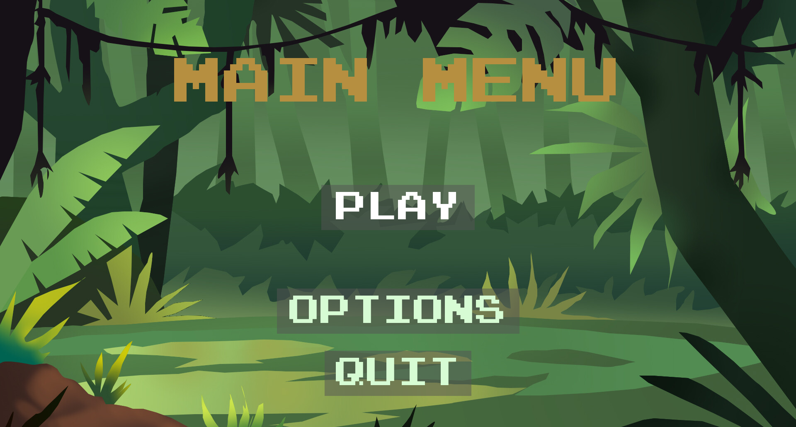
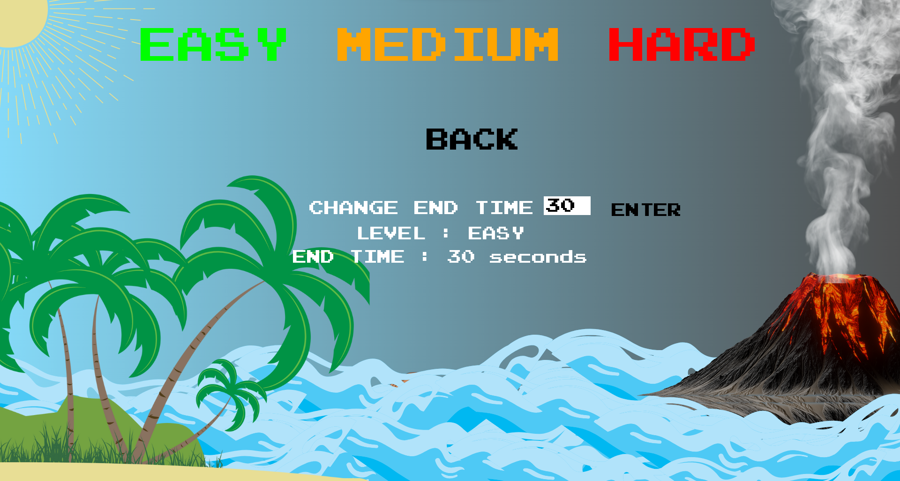
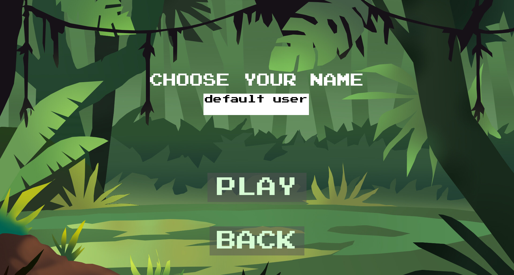
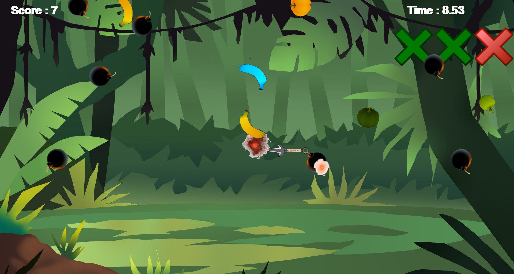
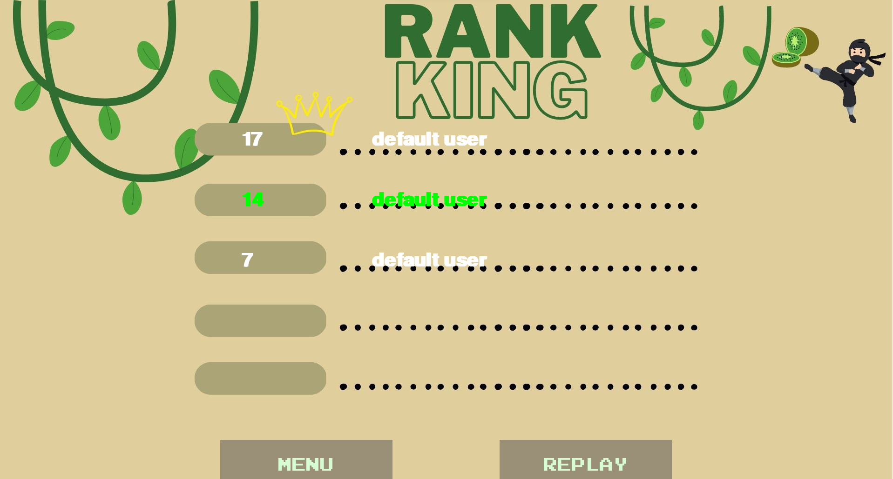

# Fruit Ninja Pygame Clone

It is a personal project. I try to recreate of the popular mobile game "Fruit Ninja" using Pygame and the webcame with OpenCv.

# Installation
* `Clone the repository`
install requirements
* `pip install requirements.txt`

Create the database. You must have MySQL.

*`python build_db.py --host #your/host --user #your/user/name --password #your/password --database #your/database/name`

Lauch the game and enjoy !

*`python main.py --host #your/host --user #your/user/name --password #your/password --database #your/database/name`

# Acknowledgments
I would like to thank the creators of the original "Fruit Ninja" game for the inspiration, and the Pygame community for their support and resources.

